## Praktikum 9: PHP Modular
Repository ini dibuat untuk memenuhi tugas Pemrograman Web
| Nama      | Lydia Diffani Siregar |
| ----------- | ----------- |
| NIM     | 312010498       |
| Kelas   | TI.20.A.1        |


## Langkah langkah praktikum 9 "PHP Modular"
Langkah langkah praktikum 9
# 1. Buat file baru dengan nama header.php
```php
<!DOCTYPE html>
<html lang="en">
<head>
    <meta charset="UTF-8">
    <title>Contoh Modularisasi</title>
    <link href="style.css" rel="stylesheet" type="text/stylesheet"
media="screen" />
</head>
<body>
    <div class="container">
        <header>
            <h1>Modularisasi Menggunakan Require</h1>
        </header>
        <nav>
            <a href="home.php">Home</a>
            <a href="about.php">Tentang</a>
            <a href="kontak.php">Kontak</a>
        </nav>
```
# 2. Buat file baru dengan nama footer.php
```php
        <footer>
            <p>&copy; 2021, Informatika, Universitas Pelita Bangsa</p>
        </footer>
    </div>
</body>
</html>
```
# 3. Buat file baru dengan nama home.php
```php
<?php require('header.php'); ?>
<div class="content">
    <h2>Ini Halaman Home</h2>
    <p>Ini adalah bagian content dari halaman.</p>
</div>
<?php require('footer.php'); ?>
```
# 4. Buat file baru dengan nama about.php
```php
<?php require('header.php'); ?>
<div class="content">
    <h2>Ini Halaman About</h2>
    <p>Ini adalah bagian content dari halaman.</p>
</div>
<?php require('footer.php'); ?>
```
# 5. Output
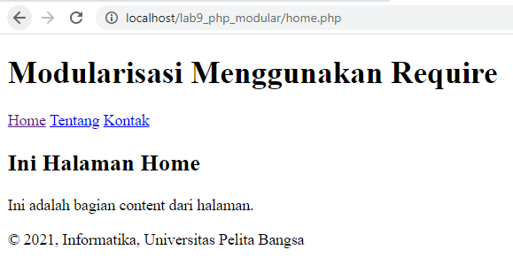


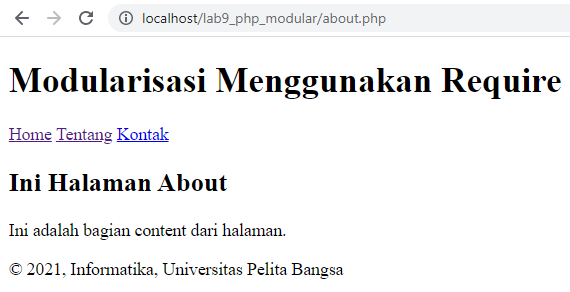


## Pertanyaan dan Tugas
Implementasikan konsep modularisasi pada kode program praktikum 8 tentang
database, sehingga setiap halamannya memiliki template tampilan yang sama.

# berikut struktur direktori yang saya buat
```php
lab8_php_database
├── config
│   ├── hapus.php
│   ├── koneksi.php
│   ├── tambah.php
│   └── ubah.php
├── layouts
│   ├── footer.php
│   ├── head-static.php
│   ├── header.php
│   ├── main.php
│   ├── tambah.php
│   └── ubah.php
├── static
│   ├── css
│   │   └── style.css
│   └── img
├── index.php
├── tambah.php
└── ubah.php
```
# config
dalam folder tersebut menyimpan file khusus php yang nanti akan dieksekusi

koneksi.php

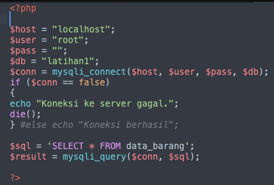

tambah.php

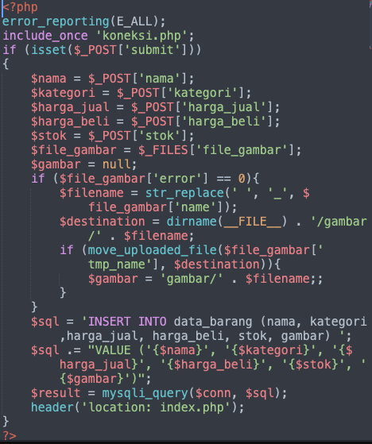

ubah.php

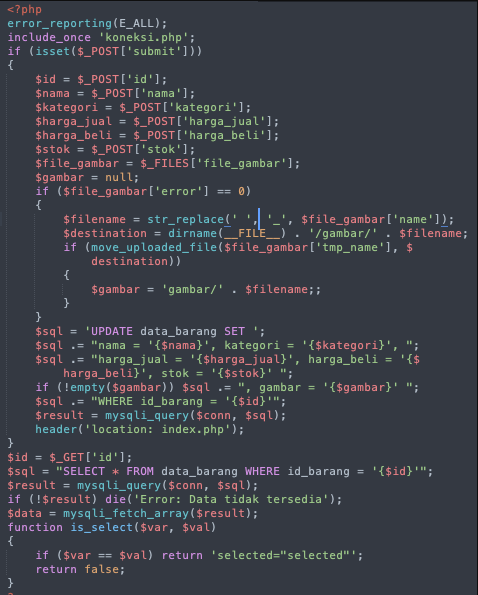

hapus.php

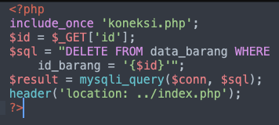

# layouts
Untuk menyimpan tampilan utama pada website, dan dibagi pada beberapa file

head-static.php

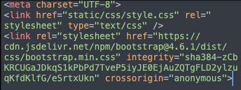

header.php


main.php

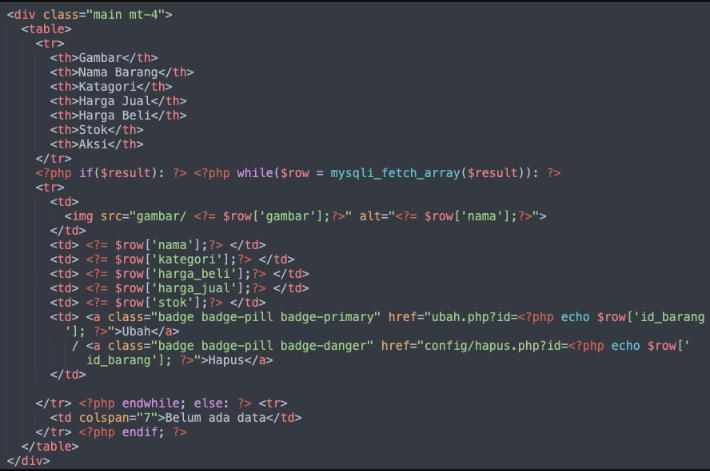

footer.php

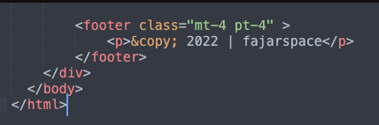

# static
Untuk menyimpan file yg diperlukan, seperti css, js, gambar

style.css

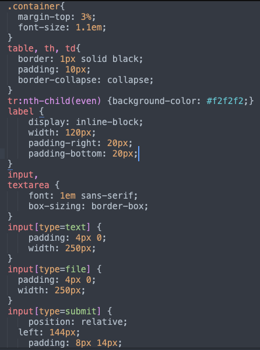

# index.php, tambah.php, ubah.php
File utama dan berfungsi sebagai wadah untuk memanggil sub-file di beberapa direktori

index.php

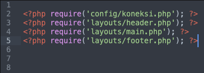

tambah.php

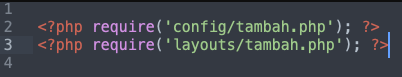

ubah.php

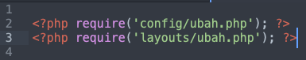

# Output

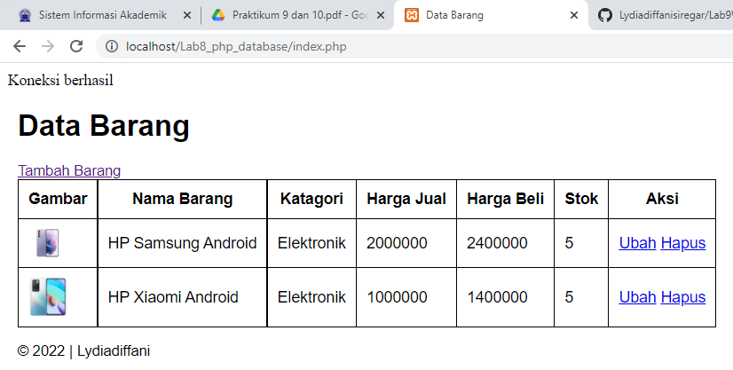

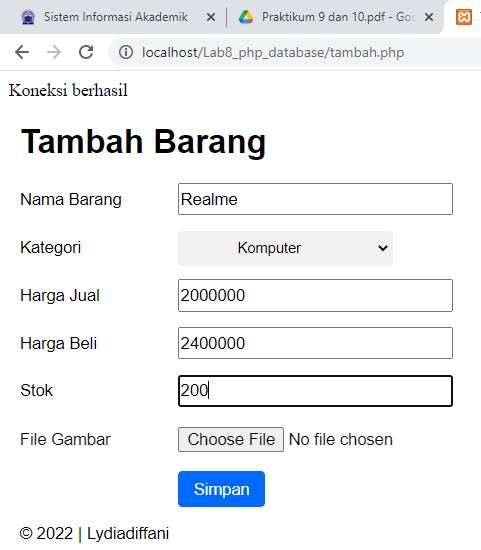

